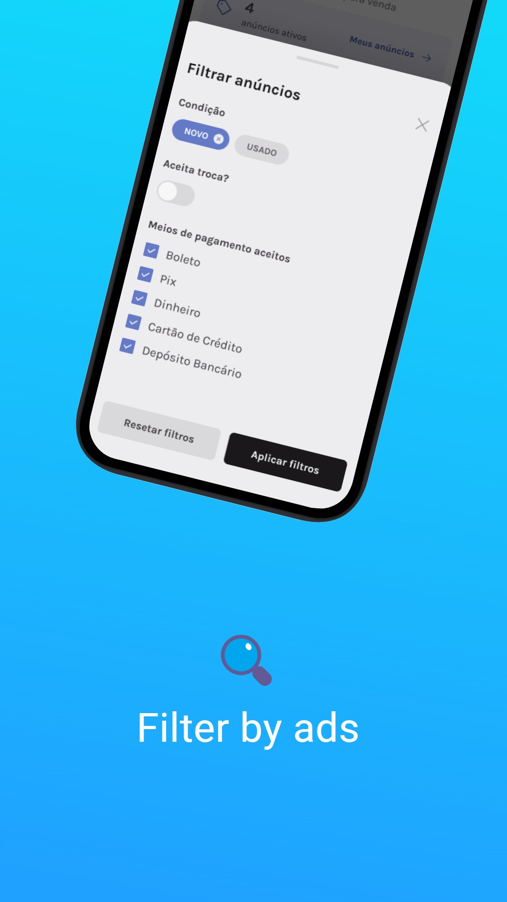

<h3 align="center">
  marketplace
</h3>

  
  

Online marketplace.

  
  
  

## 📦 Tech Stack

- Expo
- Prisma
- TypeScript

[check in api package.json](api/package.json) 
[check in mobile package.json](mobile/package.json)

## 🔩 Installation

To install and run the project locally, follow these steps:

1. Install [**Yarn**](https://yarnpkg.com/) on your computer
1. Clone the repository `git clone https://github.com/jhonbergmann/marketplace.git`
1. Navigate to the project directory: `cd marketplace/mobile` and `cd marketplace/api`
1. Install the dependencies: `yarn install`

## ⚙️ Usage

### 📱 Mobile

1. Start the development server: `yarn start`
1. Read the QR Code with the Expo Go app

### 🖥️ API

1. Start the development server: `yarn dev`

### 📝 Swagger

1. Open the API documentation: `http://localhost:3333/docs`

## 📝 License

[MIT © Jhonatan Bergmann](https://github.com/jhonbergmann/marketplace/blob/main/LICENSE)
